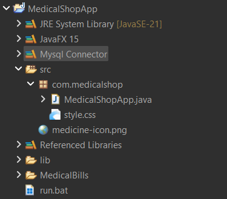

# Medical-Management-System
Medical Management System is a desktop application developed using JavaFX to manage medical store operations efficiently. The system helps in managing medicines, billing, customer records, and inventory. It provides a user-friendly interface for medical store staff to perform daily operations easily.

This project is designed to reduce manual work, improve accuracy, and provide fast access to medical store data.

## Features
* **Secure Login System**
  User authentication with username and password to ensure secure access.

* **Admin Panel**
  Admin can manage medicines, view records, and control system operations.

* **Add New Medicines**
  Easily add new medicine details including name, price, quantity, and expiry date.

* **Update Medicine Details**
  Modify existing medicine information when required.

* **Delete Medicines**
  Remove medicines from the inventory.

* **Search Medicines**
  Quickly find medicines using search functionality.

* **Generate Sales Bill**
  Create bills for customers with automatic calculation of total amount.

* **Export Bill to PDF**
  Generate and save customer bills in PDF format for printing and record keeping.

* **Manage Customer Records**
  Store and manage customer information.

* **View Complete Inventory**
  Display all available medicines in the system.

* **Automatic Total Calculation**
  Automatically calculate total price based on quantity and unit price.

* **User-Friendly Graphical Interface**
  Modern and easy-to-use interface developed using JavaFX.
  


## Technologies Used
* Java (JDK 8 or higher)

* JavaFX

* MySQL (for database)

* JDBC (Java Database Connectivity)

* CSS (for styling)


## System Requirements

* Java JDK 8 or higher

* JavaFX SDK

* MySQL Server

* Any IDE (IntelliJ IDEA, Eclipse, or NetBeans)


## Project Structure

Below is the project structure in the IDE:




## Database

Database Name: medical_shop

Tables:
* medicine_stock
* medicines
* purchases
* sales

## How to Run the Project

1. Install Java JDK and JavaFX.
2. Install MySQL and create a database named:

   ```
   medical_shop
   ```
3. Update MySQL username and password in the project file.
4. Open the project in any IDE (IntelliJ, Eclipse, or NetBeans).
5. Run `MedicalShopApp.java`.

Note: The application automatically creates required tables and data when it runs for the first time.


## Purpose of Project

This project was developed as part of academic learning to understand:

* JavaFX GUI development

* Database connectivity using JDBC

* Desktop application development

* Medical store management system design

## Author

* Name: Jitendra Khatri

* Course: BCA

* Technology: JavaFX, MySQL

# License
This project is for educational purposes only.
